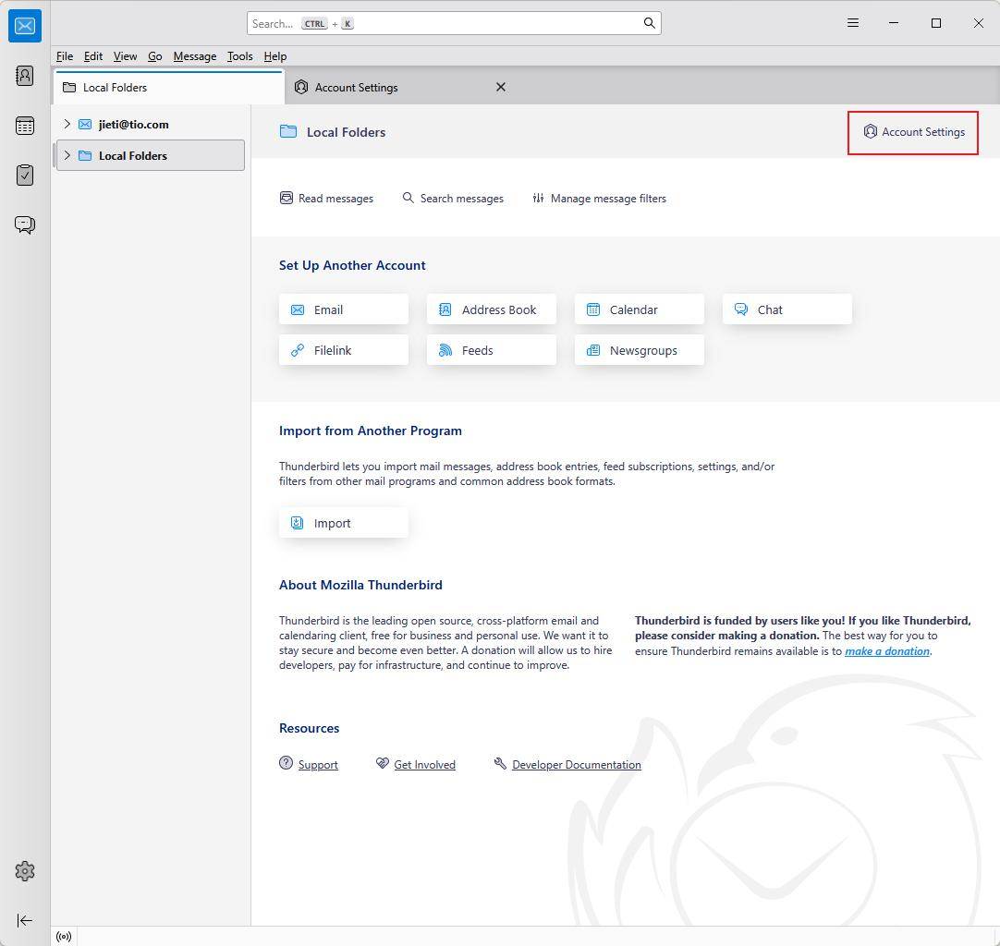
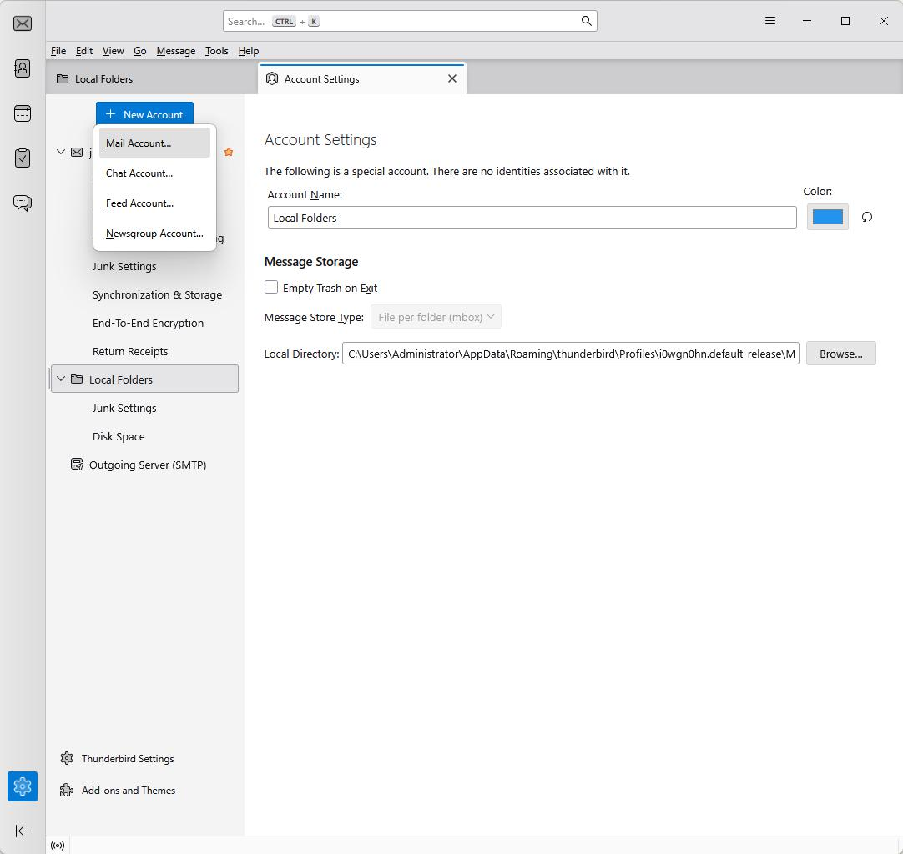
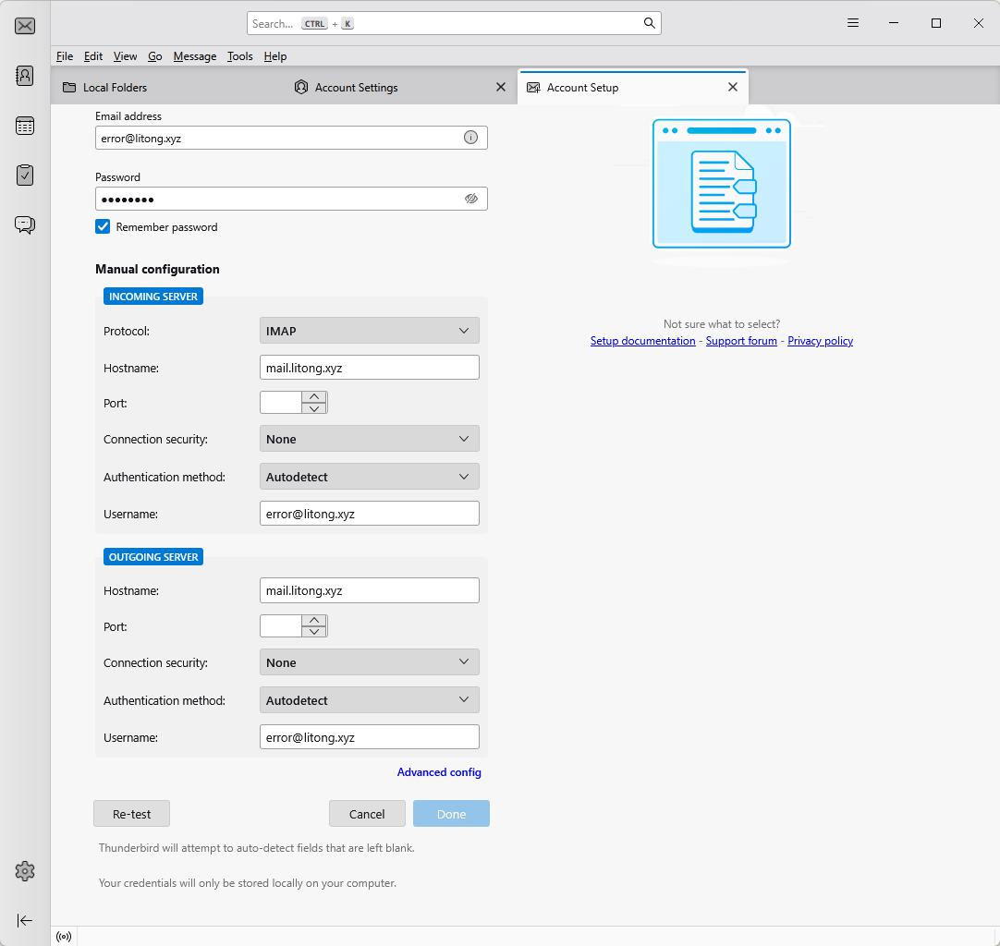
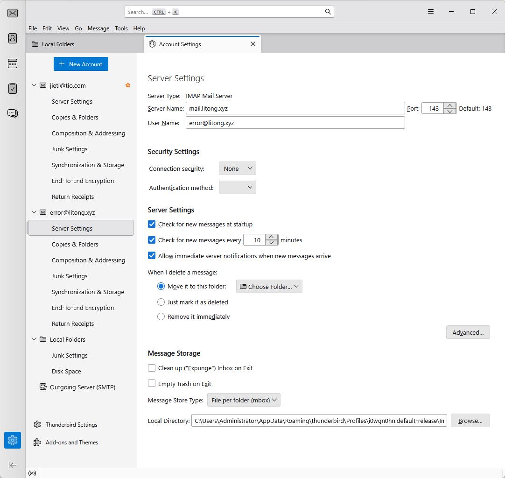
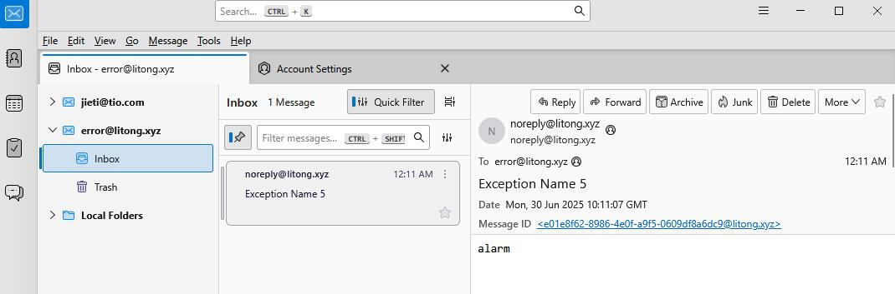

# 邮件报警系统快速接入指南

以下文档将帮助开发者在数分钟内完成邮件报警系统的接入与客户端配置。以域名 `litong.xyz`、示例邮箱 `error@litong.xyz` 为例，介绍从注册到在 Thunderbird 客户端中接收报警邮件的完整流程。

---

## 一、注册账号

1. 打开浏览器，访问：

   ```
   https://litong.xyz
   ```
2. 在注册页面输入：

   * **用户名**：`error@litong.xyz`
   * **密码**：`00000000`
3. 注册成功后，系统会提示“注册完成”，即可进行下一步。

---

## 二、测试 IMAP 登录

> 通过命令行确认您的账号和 IMAP 服务可用。

```bash
curl --url "imap://mail.litong.xyz/INBOX" \
     --user "error@litong.xyz:00000000" \
     --request "UID FETCH 1:* (FLAGS)"
```

* 如果返回类似 `* 1 FETCH (UID 1 FLAGS ())`，则说明 IMAP 登录和邮箱目录访问正常。

---

## 三、发送报警邮件

> 使用系统提供的 HTTP 接口发送测试报警。

```bash
curl --location --request POST 'https://api.litong.xyz/alarm' \
     --header 'Authorization: Bearer xxxx' \
     --header 'mail-to-user: error@litong.xyz' \
     --header 'mail-subject: Exception Name 5' \
     --header 'Content-Type: text/plain' \
     --data-raw 'alarm'
```

* **Authorization**：请替换为您在系统中申请到的 API Token。
* **mail-to-user**：接收报警的邮箱地址。
* **mail-subject**、**请求体** 可根据实际需要调整。

---

## 四、客户端配置（以 Thunderbird 为例）

下面以 [Thunderbird](https://www.thunderbird.net/en-US/)为例，演示如何配置以接收 “即时推送” 的报警邮件。

### 1. 添加新邮箱

1. 打开 Thunderbird，点击左下角齿轮图标，选择 **Account Settings**。
2. 在左上角点击 **“New Account” → “Mail Account…”**。


---

### 2. 填写邮箱信息

在弹出的“Account Setup”窗口中：

* **Email address**：`error@litong.xyz`
* **Password**：`00000000`
* 勾选 **Remember password**

点击 **Manual configuration**。

---

### 3. 手动配置服务器参数

#### IMAP（收件）

* **Protocol**：IMAP
* **Hostname**：`mail.litong.xyz`
* **Port**：`143`
* **Connection security**：None
* **Authentication method**：Autodetect
* **Username**：`error@litong.xyz`

#### SMTP（发件，可选）

* **Hostname**：`mail.litong.xyz`
* **Port**：`25`（或其他）
* **Connection security**：None
* **Authentication method**：Autodetect
* **Username**：`error@litong.xyz`

---

### 4. 验证与调整

#### 4.1 “Re-test” 会失败

点击 **Re-test** 后，如果出现连接失败，这是正常现象可以忽略。

#### 4.2 选择 “Advanced Config”

根据提示切换到“Advanced Config”，填写与 **步骤 3** 完全相同的参数，并保存。

---

### 5. 启用即时消息推送

1. 在 **Account Settings → Server Settings** 中，确保勾选：
   * **Check for new messages at startup**
   * **Check for new messages every *10* minutes**
   * **Allow immediate server notifications when new messages arrive**
2. 点击 **OK** 保存设置。

---

## 五、效果验证

当后端触发报警并调用 HTTP 接口后，Thunderbird 客户端会在几秒内弹出新邮件提醒。如下所示：



邮件内容示例：

```
From: noreply@litong.xyz
To: error@litong.xyz
Subject: Exception Name 5
Date: Mon, 30 Jun 2025 10:11:07 GMT

alarm
```

至此，邮件报警系统的接入与客户端配置全部完成。您可以根据需要在后端业务逻辑中定制报警内容、触发条件，以及调整客户端的接收策略。祝开发顺利！