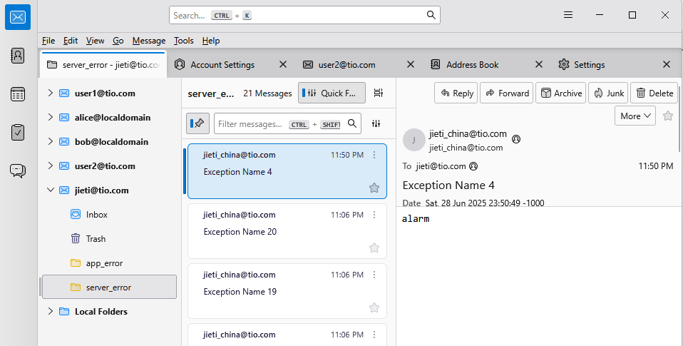

# tio-mail-wing

[](https://github.com/litongjava/tio-mail-wing)

`tio-mail-wing` 是一个基于 Java 的轻量级邮件服务器，实现了 IMAP 和 SMTP 协议。

## 特性

* **IMAP 支持**：IMAP4rev1，包含 UIDPLUS、MOVE、PEEK、特殊用法扩展。
* **SMTP 支持**：SMTP AUTH LOGIN/PLAIN 验证。
* **用户/邮箱管理**：通过数据库（PostgreSQL 等）管理用户和邮箱目录。
* **邮件存储**：去重存储消息内容，支持原子化 UID 分配。
* **扩展性**：可配置日志、端口、数据库连接等。

## 快速开始

### 系统要求

* Java 8 或更高版本
* Maven 3.x
* 支持的数据库（默认 PostgreSQL）

### 克隆与构建

```bash
git clone https://github.com/litongjava/tio-mail-wing.git
cd tio-mail-wing
mvn clean package
```

### 运行

```bash
java -jar target/tio-mail-wing.jar
```

## 配置

默认配置文件 `application.properties` 中，可配置以下关键参数：

| 参数                           | 描述             | 示例     |
| ---------------------------- | -------------- | ------ |
| `mail.server.imap.port`      | IMAP 服务监听端口    | `143`  |
| `mail.server.smtp.port`      | SMTP 服务监听端口    | `25`   |

示例：

```properties
# IMAP 和 SMTP 端口
mail.server.imap.port=143
mail.server.smtp.port=25
jdbc.url=jdbc:postgresql://192.168.3.9/defaultdb
jdbc.user=postgres
jdbc.pswd=00000000
jdbc.MaximumPoolSize=2
```

## 使用示例

* **IMAP 客户端连接**：

  * 主机：`localhost`
  * 端口：`${mail.server.imap.port}`
  * 用户名/密码：在数据库中配置的用户

* **SMTP 客户端连接**：

  * 主机：`localhost`
  * 端口：`${mail.server.smtp.port}`
  * 验证方式：AUTH LOGIN/PLAIN

## 数据库初始化

项目中提供了 `db/schema.sql`，和 `db/truncate.sql`包括建表语句和必要的视图。请根据实际情况在数据库中执行：

## 整合到报警系统
整合到基于tio-boot框架的系统中
```
<dependency>
  <groupId>com.litongjava</groupId>
  <artifactId>tio-mail-wing</artifactId>
  <version>1.0.0</version>
</dependency>
```

```java
package com.sejie.admin.config;

import com.litongjava.annotation.AConfiguration;
import com.litongjava.annotation.Initialization;
import com.litongjava.tio.boot.server.TioBootServer;
import com.sejie.admin.statistics.MyHttpResponseStatisticsHandler;
import com.tio.mail.wing.config.ImapServerConfig;
import com.tio.mail.wing.config.SmtpServerConfig;

@AConfiguration
public class TioBootServerConfig {

  @Initialization
  public void config() {
    //smpt
    new SmtpServerConfig().startSmtpServer();
    //imap
    new ImapServerConfig().startImapServer();
  }
}

```

创建用户jieti@tio.com 邮箱server_error接受服务端错误,app_error接收客户端错误
```sql
WITH new_users AS (
  INSERT INTO mw_user (id, username, password_hash, creator, updater, tenant_id) VALUES
  (1004, 'jieti@tio.com', '600000$4JRI3BfykBwVVHwSXuUYmA==$qefBA/+M2pcr9o6p4ycojdHNnLAhTs9+7cmSjp664ww=', 'system', 'system', 1)
  RETURNING id, username
),
mailbox_names (name) AS (
  -- 步骤2: 定义需要创建的邮箱名称列表
  VALUES ('inbox'), ('trash'),('server_error'), ('app_error'),('im_error'),('desktop_error')
),
mailboxes_to_create AS (
  -- 步骤3: 生成用户和邮箱名的所有组合，并为每个组合生成唯一的邮箱ID
  SELECT
    -- 动态生成邮箱ID (示例策略)
    (new_users.id * 100 + ROW_NUMBER() OVER (PARTITION BY new_users.id ORDER BY mailbox_names.name)) AS mailbox_id,
    new_users.id AS user_id,
    mailbox_names.name AS mailbox_name
  FROM new_users
  CROSS JOIN mailbox_names
)
-- 步骤4: 插入邮箱数据，并将邮箱自己的ID用作UIDVALIDITY
INSERT INTO mw_mailbox (id, user_id, name, uid_validity, creator, updater, tenant_id)
SELECT
  mailbox_id,
  user_id,
  mailbox_name,
  mailbox_id,
  'system',
  'system',
  1
FROM mailboxes_to_create;


-- =================================================================
-- 验证插入结果 (可选)
-- =================================================================
SELECT
  u.id AS user_id,
  u.username,
  m.id AS mailbox_id,
  m.name AS mailbox_name,
  m.uid_validity,
  m.uid_next
FROM mw_user u
JOIN mw_mailbox m ON u.id = m.user_id
ORDER BY u.id, m.name;
```

添加ErrorAlarmHandler接收报警信息
```java
package com.tio.mail.wing.handler;

import com.litongjava.jfinal.aop.Aop;
import com.litongjava.tio.boot.http.TioRequestContext;
import com.litongjava.tio.http.common.HttpRequest;
import com.litongjava.tio.http.common.HttpResponse;
import com.tio.mail.wing.model.MailRaw;
import com.tio.mail.wing.service.MailSaveService;

public class ErrorAlarmHandler {

  private MailSaveService mailSaveService = Aop.get(MailSaveService.class);
  public HttpResponse send(HttpRequest request) {
    HttpResponse response = TioRequestContext.getResponse();

    String fromUser = request.getHeader("mail_from_user");
    String toUser = request.getHeader("mail_to_user");
    String mailBox = request.getHeader("mail_to_mailbox");
    if (mailBox == null) {
      mailBox = "server_error";
    }
    String subject = request.getHeader("mail_subject");
    if (subject == null) {
      subject = "server_error";
    }

    String body = request.getBodyString();

    // 使用建造者模式创建一个邮件对象
    MailRaw mail = MailRaw.builder().from(fromUser).to(toUser).subject(subject).body(body).build();

    // Act: Save the email to the recipient's inbox
    boolean success = mailSaveService.saveEmail(toUser, mailBox, mail);
    if (success) {
      response.setStatus(200);
    } else {
      response.setStatus(500);
    }
    return response;
  }
}
```

```java
    HttpRequestRouter r = TioBootServer.me().getRequestRouter();
    if (r != null) {
      ErrorAlarmHandler errorAlarmHandler = new ErrorAlarmHandler();
      r.add("/alarm", errorAlarmHandler::send);
    }
```
发送测试
```
curl --location --request POST 'http://localhost/alarm' \
--header 'mail_from_user: jieti_china@tio.com' \
--header 'mail_to_user: jieti@tio.com' \
--header 'mail_to_mailbox: server_error' \
--header 'mail_subject: Exception Name 4' \
--header 'Content-Type: text/plain' \
--header 'Accept: */*' \
--header 'Host: localhost' \
--header 'Connection: keep-alive' \
--data-raw 'alarm'
```
使用客户端拉取报警信息,我使用的客户端Thunderbrid显示信息如下


## 配置DNS
| 类型      | 主机名                 | 值／内容                                                 | 优先级 | 说明                                     |
| ------- | ------------------- | ---------------------------------------------------- | --- | -------------------------------------- |
| **A**   | mail                |  公司IP                                         | —   | mail.litong.xyz → 你的邮件服务器公网 IP         |
| **MX**  | @ (根域名)             | mail.litong.xyz                                      | 10  | 所有发往 litong.xyz 的邮件都交给 mail.litong.xyz |
| **TXT** | @                   | 	v=spf1 mx ~all                                     | —   | SPF：只允许 MX 主机（也就是 mail.litong.xyz）发信   |
| **TXT** | default._domainkey | （你的 DKIM 公钥）                                         | —   | DKIM：签名验证，需先在服务器生成密钥对                  |
| **TXT** | _dmarc             | 	v=DMARC1; p=none; rua=mailto:postmaster@litong.xyz | —   | DMARC：告知收件端如何处理未通过 SPF/DKIM 的邮件        |

## 贡献

欢迎提交 Issue 或 Pull Request！

1. Fork 本仓库
2. 新建分支 `feature/xxx`
3. 提交改动并发起 Pull Request

## 许可证

本项目采用 Apache-2.0 许可证，详情请参见 [LICENSE](LICENSE)。
